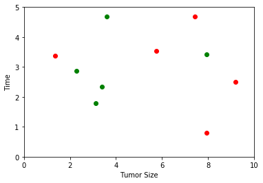

```python
import numpy as np
from math import sqrt
from collections import Counter
# knn
class kNNClassifier:

    def __init__(self, k):
        """初始化分类器"""
        assert k >= 1, "k must be valid"
        self.k = k
        self._X_train = None
        self._y_train = None

    def fit(self, X_train, y_train):
        """根据训练数据集X_train和y_train训练kNN分类器"""
        assert X_train.shape[0] == y_train.shape[0], \
            "the size of X_train must be equal to the size of y_train"
        assert self.k <= X_train.shape[0], \
            "the size of X_train must be at least k"
        self._X_train = X_train
        self._y_train = y_train
        return self

    def predict(self,X_predict):
        """给定待预测数据集X_predict，返回表示X_predict结果的向量"""
        assert self._X_train is not None and self._y_train is not None, \
            "must fit before predict!"
        assert X_predict.shape[1] == self._X_train.shape[1], \
            "the feature number of X_predict must be equal to X_train"
        y_predict = [self._predict(x) for x in X_predict]
        return np.array(y_predict)

    def _predict(self, x):
        distances = [sqrt(np.sum((x_train - x) ** 2)) for x_train in self._X_train]
        nearest = np.argsort(distances)
        topK_y = [self._y_train[i] for i in nearest]
        votes = Counter(topK_y)
        return votes.most_common(1)[0][0]
    def __repr__(self):
        return "kNN(k=%d)" % self.k

```


```python

# raw_data_x是特征，raw_data_y是标签，0为良性，1为恶性
raw_data_X = [[3.393533211, 2.331273381],
              [3.110073483, 1.781539638],
              [1.343853454, 3.368312451],
              [3.582294121, 4.679917921],
              [2.280362211, 2.866990212],
              [7.423436752, 4.685324231],
              [5.745231231, 3.532131321],
              [9.172112222, 2.511113104],
              [7.927841231, 3.421455345],
              [7.939831414, 0.791631213]
             ]
raw_data_y = [0, 0, 0, 0, 0, 1, 1, 1, 1, 1]

# 设置训练组
X_train = np.array(raw_data_X)
y_train = np.array(raw_data_y)

# 将数据可视化
plt.scatter(X_train[y_train==0,0],X_train[y_train==0,1], color='g', label = 'Tumor Size')
plt.scatter(X_train[y_train==1,0],X_train[y_train==1,1], color='r', label = 'Time')
plt.xlabel('Tumor Size')
plt.ylabel('Time')
plt.axis([0,10,0,5])
plt.show()
```





```python
# 需要预测的点
# x=np.array([8.90933607318, 3.365731514])
x=np.array([1.20933607318, 7.225731514])

# 设置k值--取的近邻数
knn_clf = kNNClassifier(k=6)
# 用样本数据集训练模型
knn_clf.fit(X_train, y_train)
# 格式化预测点
X_predict = x.reshape(1,-1)
# 得到预测结果
y_predict = knn_clf.predict(X_predict)
y_predict[0]
```


    0


```python
from sklearn.neighbors import KNeighborsClassifier

x=np.array([8.90933607318, 3.365731514, 1.20933607318, 7.225731514, 3.20933607318, 3.225731514])

# 创建kNN_classifier实例
kNN_classifier = KNeighborsClassifier(n_neighbors=6)

# kNN_classifier做一遍fit(拟合)的过程，没有返回值，模型就存储在kNN_classifier实例中
kNN_classifier.fit(X_train, y_train)

# kNN进行预测predict，需要传入一个矩阵，而不能是一个数组。reshape()成一个二维数组，第一个参数是1表示只有一个数据，第二个参数-1，numpy自动决定第二维度有多少
y_predict = kNN_classifier.predict(x.reshape(3,-1))
y_predict
```


    array([1, 0, 0])


```python

```
